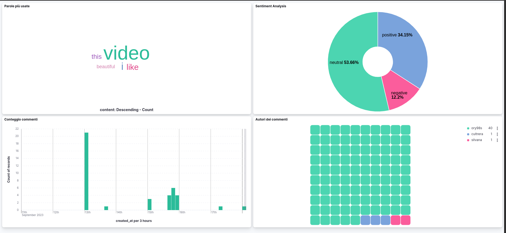

# Youtube Comments Sentiment Analyzer

Comment analyzer for youtube videos to track user reactions on your channel!

## Table of Contents

- [Introduction](#introduction)
- [Technologies Used](#technologies-used)
- [Project Structure](#project-structure)
- [System Requirements](#system-requirements)
- [Installation and Configuration](#installation-and-configuration)
- [Usage](#usage)
- [Developed By](#developed-by)
- [License](#license)

## Introduction
The main goal of this project is to provide moderators of youtube channels with a simple and powerful tool to be able to analyze reactions to posted videos in real time 

## Technologies Used

- **Ingestion**:
    - Python Script: extraction of comments using [Youtube Data API](https://developers.google.com/youtube/v3 "Youtube Data API")
    - [Logstash](https://www.elastic.co/logstash 
    "Logstash")
- **Streaming**:
    - [Apache Kafka](https://www.confluent.io/what-is-apache-kafka "Apache Kafka")
- **Processing**:
    - [Spark Streaming](https://spark.apache.org/streaming/ "Spark Streaming")
- **Indexing**:
    - [ElasticSearch](https://www.elastic.co/what-is/elasticsearch "ElasticSearch")
- **Visualization**:
    - [Kibana](https://www.elastic.co/what-is/kibana "Kibana")

## Project Structure

This is the project workflow:


### A brief recap

1. The python script extracts the comments from the video specified in the .env file and sends them to Logstash using TCP socket
2. Logstash receives the comments and sends them to Kafka topic "youtube"
3. Spark Streaming reads the comments from the Kafka topic and performs sentiment analysis using Vader or MlLib
4. The comments are indexed ElasticSearch
5. Kibana reads the data from ElasticSearch and displays it in a dashboard


## System Requirements

This project uses Docker as a containerization tool. 
The only requirement is to have Docker installed on your operating system. For any doubts, consult the [official documentation.](https://docs.docker.com/engine/install/ "official documentation")


## Installation and Configuration

1. Clone the repository and enter the project folder:
```shell
$ git clone
$ cd youtube_sentiment_analyzer
```
2. Create a file named .env based on the .env.example file
```shell
$ cp .env.example .env
```

3. Edit the .env file with your own configuration. In particular you have to add:
    - VIDEO_URL: the url of the video you want to analyze
    - API_KEY: Youtube Api Key (you can get it [here](https://developers.google.com/youtube/v3/getting-started "here"))
```shell
$ nano .env
#replace the values with your own
```
## Usage

### Using docker-compose

1. Start the containers:
    Move into the /bin folder and run the following command:
    ```shell
    $ cd bin
    $ bash dockerComposeStart.sh
    ```
    This will start all the containers needed for the project.
2. Visit the Kibana dashboard:
    Open your browser and go to http://localhost:5601
3. Enjoy the dashboard:
    You can now see the dashboard and the data collected from the video you specified in the .env file.



## Developed by
[Orazio Sciuto](https://github.com/orazios98)

## License
[MIT](https://choosealicense.com/licenses/mit/ "MIT")