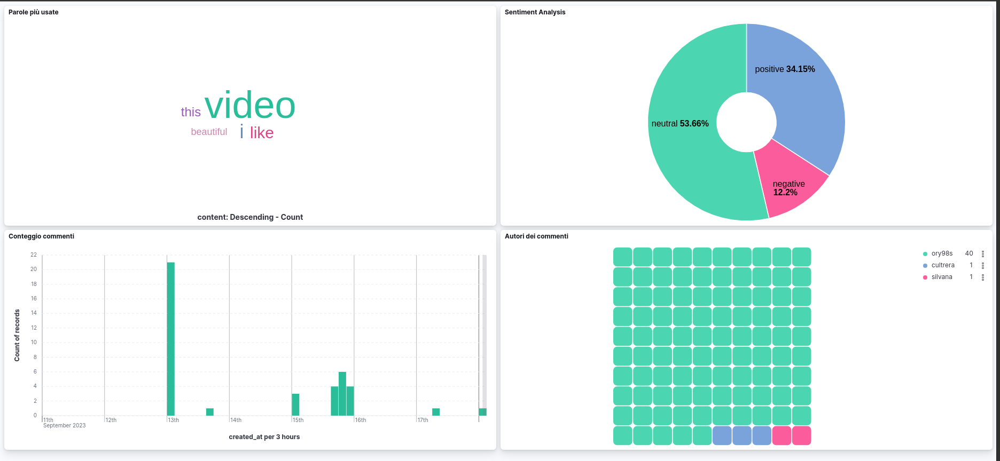

# Kibana

Kibana is an open source data visualization dashboard for Elasticsearch. It provides visualization capabilities on top of the content indexed on an Elasticsearch cluster. Users can create bar, line and scatter plots, or pie charts and maps on top of large volumes of data.

In this project Kibana is used to display the results of the sentiment analysis performed on the comments of a Youtube video.

## Usage

After running docker-compose, Kibana is available at http://localhost:5601

To view the dashboard, you need to create an index pattern. To do this, follow these steps:

1. Click on "Management" in the left menu
2. Click on "Index Patterns"
3. Click on "Create index pattern"
4. Enter "youtubecomments" as index pattern name
5. Click on "Next step"
6. Select "created_at" as Time Filter field name
7. Click on "Create index pattern"
8. Click on "Discover" in the left menu
9. Enjoy the dashboard

## Example

This is an example of the dashboard with 4 visualizations:
1. A pie chart showing the percentage of positive, negative and neutral comments
2. A bar chart showing the number of comments per hour
3. A tag cloud showing the most frequent words in the comments
4. A wall showing the most frequent authors of the comments

